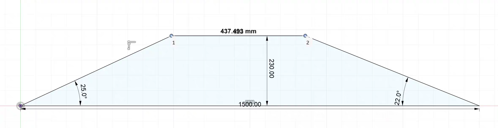
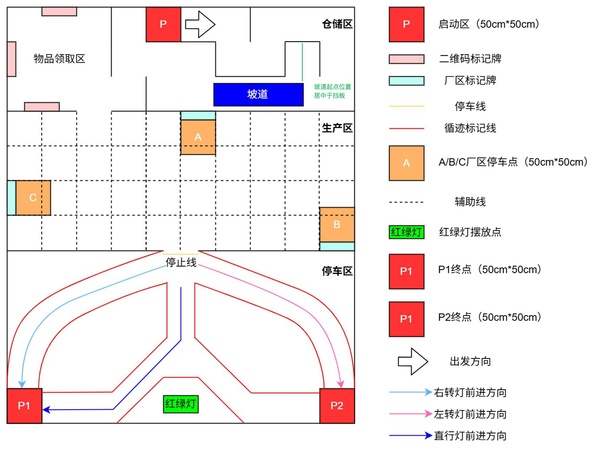
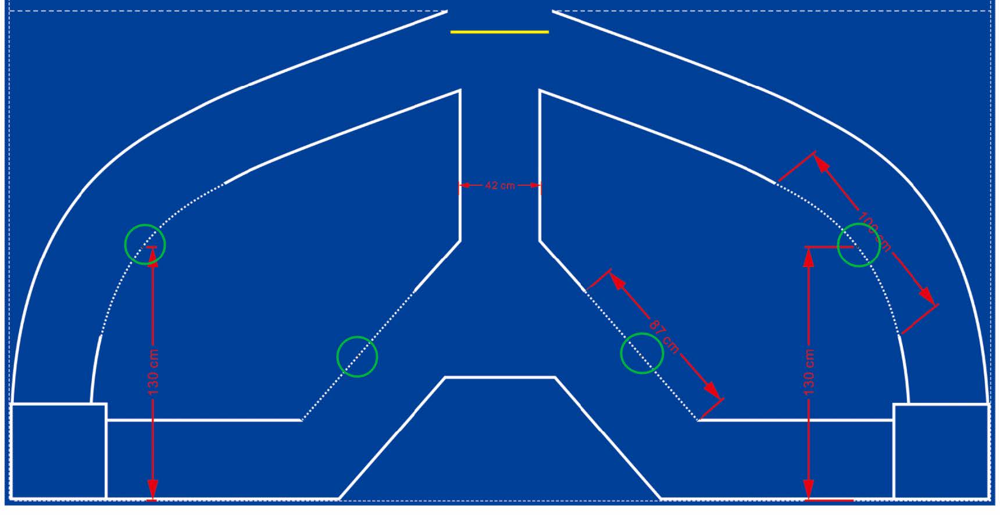
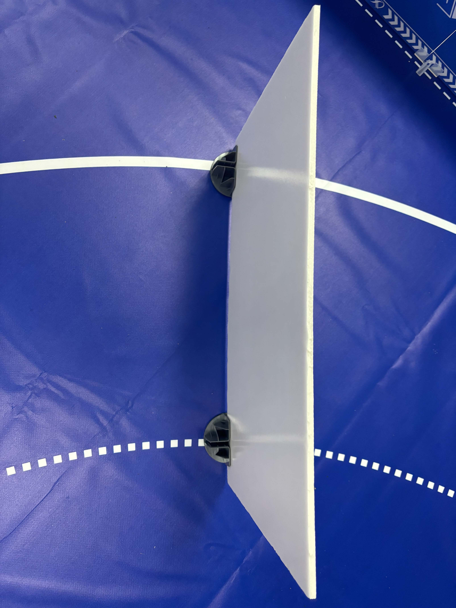

# 关于第21届全国大学生智能汽车竞赛讯飞创意组“智慧工厂”赛题全国总决赛规则补充说明的通知

- **发布对象：** 各参赛高校、各参赛队
- **适用组别：** 讯飞创意组“智慧工厂”赛题
- **文件性质：** 全国总决赛规则补充说明
- **生效时间：** 自发布之日起

各参赛高校、各参赛队：

为进一步提升第21届全国大学生智能汽车竞赛讯飞创意组“智慧工厂”赛题全国总决赛的技术挑战性与综合考查能力，确保各参赛队准确理解比赛任务及现场判定要求，现对全国总决赛新增任务和有关技术要求作如下补充说明，请各参赛队认真阅读并据此做好备赛工作。

本通知未作调整或未予说明的内容，继续按照本届竞赛已发布的赛题规则及相关文件执行。

## 一、全国总决赛新增任务

全国总决赛在原有比赛任务基础上增加以下内容：

1. **坡道通行任务。** 参赛车辆须按照规定路线完成坡道区域的通行。
2. **交通信号灯状态变化任务。** 红绿灯增加定时状态切换要求，参赛车辆须根据信号灯状态及停止线判定规则完成通行或等待。
3. **巡线避障任务。** 指定巡迹路段设置挡板，参赛车辆须在规定区域内完成自主避障，并重新驶回巡迹路线。

全国总决赛场地总体布局及主要标识说明如下图所示。图中包括启动区、物品领取区、仓储区、生产区、停车区、坡道、停止线、巡迹标记线、辅助线、红绿灯摆放点及各终点区域等。

> **说明：** 场地图用于说明各功能区域、任务设施及行驶路线之间的相对关系。现场设施的具体摆放、边界标识和裁判判定，以组委会正式布置的比赛场地及现场裁判指令为准。

## 二、坡道通行任务说明

### （一）坡道尺寸

坡道宽度为 **38 cm**。坡道侧面结构及主要尺寸如下图所示：

按照示意图标注，坡道底部总长度为 **1500 mm**，最高点距地面高度为 **230 mm**，顶部平台长度约为 **437.493 mm**，两侧坡面标注角度分别为 **25°** 和 **22°**。

### （二）坡道位置

坡道设置在仓储区与生产区之间的指定位置，具体位置如下图所示。坡道起点按图示要求布置，其中心位置与相应挡板位置居中对齐。

### （三）通行要求

1. 参赛车辆应沿任务路线自主进入坡道区域，并依次完成上坡、通过顶部平台和下坡过程。
2. 车辆通过坡道时，应保持车体运行稳定，确保车辆能够连续、完整地通过坡道结构。
3. 坡道通行过程中涉及越界、碰撞、人工干预、中途停车或未完成任务等情形的认定及处理，按照本届竞赛已发布的相关规则执行。
4. 各参赛队应充分考虑坡道宽度、坡面角度、离地高度、车辆轴距、轮距、重心、动力输出及制动控制等因素，提前完成车辆结构与控制策略的适配。

## 三、交通信号灯状态变化任务说明

### （一）状态切换要求

全国总决赛使用的红绿灯设备增加定时状态切换功能，状态变化顺序为：

**红灯 → 绿灯 → 黄灯 → 红灯**

具体时间要求如下：

1. 绿灯状态开始后，设备应在 **2 s 内（含 2 s）** 切换为黄灯状态。
2. 黄灯状态开始后，设备应在 **2 s 内（含 2 s）** 切换为红灯状态。
3. 状态切换及计时以现场正式比赛设备显示结果和裁判记录为准。

### （二）停止线通行判定

1. 当信号灯处于绿灯或黄灯状态时，若参赛车辆的前轮已通过停止线，则车辆可以继续通行。
2. 当信号灯切换为红灯时，若参赛车辆前轮尚未通过停止线，车辆须在停止线前等待，不得继续驶入路口区域。
3. 未能在本轮信号周期内满足通行条件的车辆，应等待下一轮信号指令后再行通过。
4. 选手可在信号灯切换为红灯状态后，直接向设备发送下一轮状态切换指令。
5. “前轮通过停止线”的判定以车辆前轮与停止线的相对位置为依据；存在临界情形时，以现场裁判的观察和判定为准。

## 四、巡线避障任务说明

巡线避障区域及挡板设置位置如下图所示。图中绿色圆圈标示挡板的预定摆放位置。

### （一）任务要求

1. 比赛现场将在图示绿色圆圈位置设置挡板，挡板垂直于虚线。参赛车辆行驶至相应位置后，须自主识别或感知障碍，并完成避障。
2. 车辆实施避障时，只允许从图示虚线段驶出原巡迹路线；绕过挡板后，须从规定的虚线段重新驶入巡迹路线。
3. 除图示虚线允许区域外，车辆不得从其他位置驶出或驶回巡迹路线，如压实线则按照压线规则扣分。
4. 避障过程中，车辆任何部位均不得与挡板发生碰撞或接触。
5. 车辆完成避障并重新驶入巡迹路线后，应继续按照既定任务路线运行。

### （二）判定说明

1. 车辆是否在规定虚线区域驶出、驶回，以车辆实际行驶轨迹及现场裁判观察结果为准。
2. 挡板是否发生接触、移动或倾倒，以现场实际状态及裁判判定为准。
3. 未按规定区域避障、碰撞挡板或未能重新驶回巡迹路线等情形，按照本届竞赛已发布的相关规则进行认定和处理。

## 五、比赛实施及其他说明

1. 各参赛队应在赛前完成坡道通过能力、信号灯状态识别与响应、停止线判定、巡线控制及自主避障等功能的联调测试。
2. 比赛使用的坡道、挡板、红绿灯及场地标识由组委会统一设置。未经允许，任何参赛队及个人不得移动、调整或接触比赛设施。
3. 示意图所列尺寸和位置是比赛准备与技术适配的重要依据；比赛设施及场地边界以组委会验收并最终公布的现场实物为准，参赛车辆应具备必要的环境适应能力。
4. 比赛开始、设备触发、任务执行和比赛结束等环节，均应服从现场裁判统一指令。
5. 本通知未明确的计分、扣分、重赛、申诉及其他竞赛事项，按照本届竞赛总规则、赛题规则及组委会最新发布的正式文件执行。
6. 如本通知内容与此前发布的相关说明存在不一致，以组委会最新发布的正式文件为准。

请各参赛高校及时将本通知传达至指导教师和参赛队员，并认真组织学习、测试与备赛。比赛期间，各参赛队应自觉遵守竞赛纪律，服从现场组织与裁判安排，共同维护公平、有序的竞赛环境。

特此通知。

第21届全国大学生智能汽车竞赛  
（讯飞创意组）  
2026年08月14日

